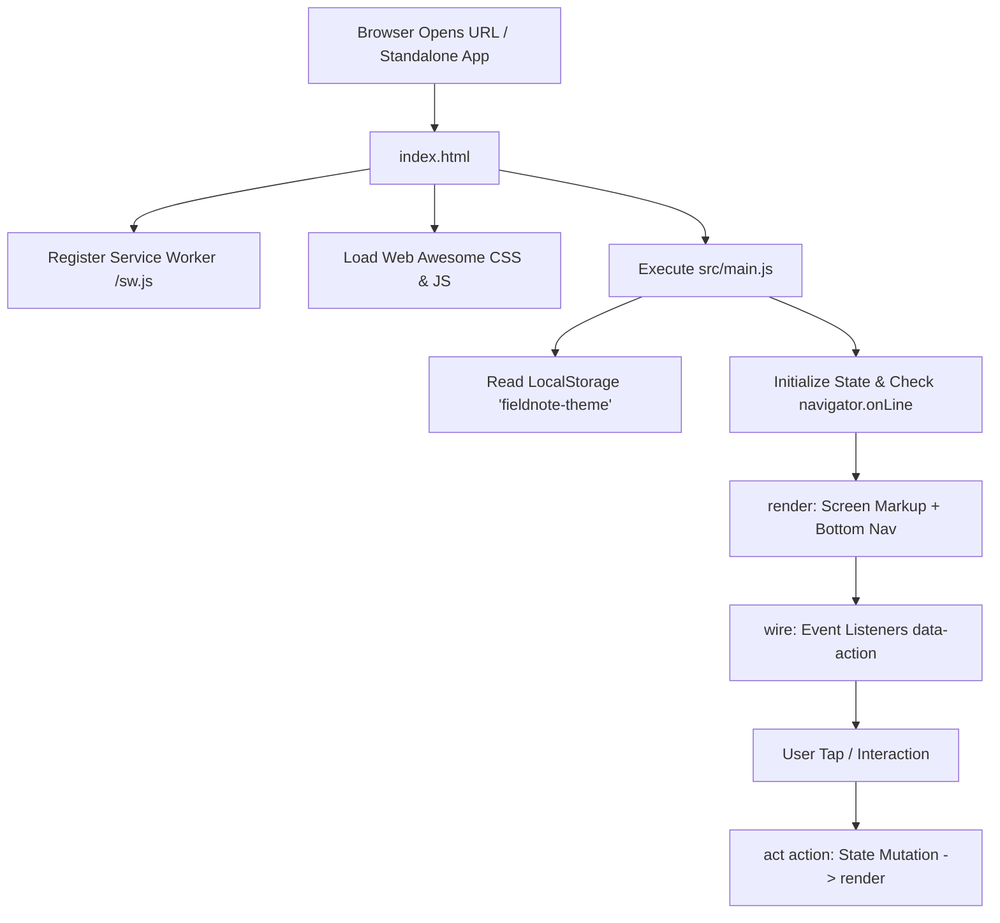
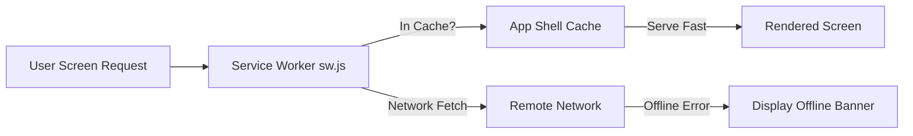
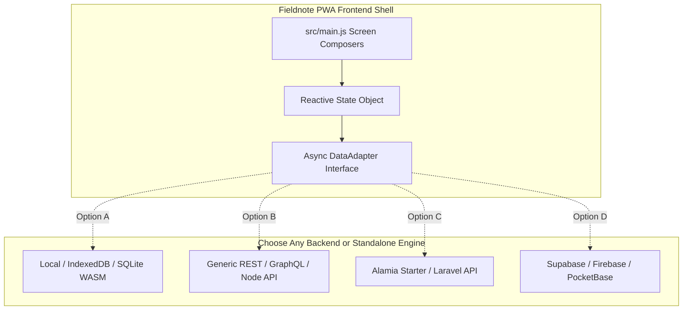

# Dependency & Runtime Flow Map

## 1. Runtime Flow & Lifecycle

```mermaid
graph TD
    A[Browser Opens URL / Standalone App] --> B[index.html]
    B --> C[Register Service Worker /sw.js]
    B --> D[Load Web Awesome CSS & JS]
    B --> E[Execute src/main.js]
    E --> F[Read LocalStorage 'fieldnote-theme']
    E --> G[Initialize State & Check navigator.onLine]
    G --> H[render: Screen Markup + Bottom Nav]
    H --> I[wire: Event Listeners data-action]
    I --> J[User Tap / Interaction]
    J --> K[act action: State Mutation -> render]
```

## 2. PWA Network Interception Map

```mermaid
graph LR
    User[User Screen Request] --> SW[Service Worker sw.js]
    SW -->|In Cache?| Cache[App Shell Cache]
    SW -->|Network Fetch| Net[Remote Network]
    Cache -->|Serve Fast| UI[Rendered Screen]
    Net -->|Offline Error| Banner[Display Offline Banner]
```

## 3. Pluggable Data Integration Boundary (Backend-Agnostic)

```mermaid
graph TD
    subgraph Frontend [Fieldnote PWA Frontend Shell]
        UI[src/main.js Screen Composers]
        State[Reactive State Object]
        Adapter[Async DataAdapter Interface]
    end

    subgraph PluggableBackends [Choose Any Backend or Standalone Engine]
        Local[Local / IndexedDB / SQLite WASM]
        REST[Generic REST / GraphQL / Node API]
        SaaS[Alamia Starter / Laravel API]
        BaaS[Supabase / Firebase / PocketBase]
    end

    UI --> State
    State --> Adapter
    Adapter -.->|Option A| Local
    Adapter -.->|Option B| REST
    Adapter -.->|Option C| SaaS
    Adapter -.->|Option D| BaaS
```
