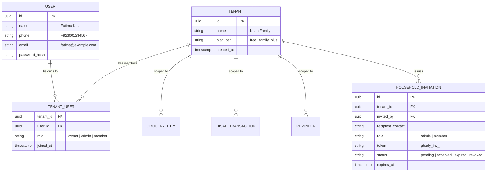
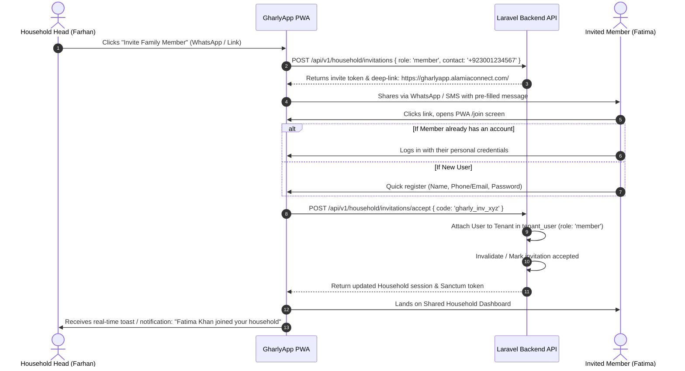

# Household & Family Member Invitation Architecture

## 1. Overview & Tenancy Model

In **DigEzLife (GharlyApp)**, data is isolated by **Household (Tenant)**. A household represents a home unit (e.g. *"Khan Family"* or *"House #42"*). 

### Key Architectural Invariant: Separate User Logins Under Shared Tenancy
Family members **never** share account passwords. Every family member creates and authenticates with their own distinct user account (phone number, email, or social login) and receives their own Sanctum authentication token. 

All family members of the same household share the same `tenant_id`, enabling real-time collaboration on:
- 🛒 **Shared Grocery Lists** (synchronized checklist items, real-time item status).
- 💰 **Household Hisab & Cashflow** (shared expenses, udhaar trackers, category totals).
- ⏰ **Bill Reminders & Family Tasks** (utility bills, rent alerts, recurring tasks).

---

## 2. Family Roles & Permissions

| Role | Badge | Permissions |
| :--- | :---: | :--- |
| **Owner / Head** | 👑 Owner | Full access; subscription & billing management; manage all members; delete household. Cannot be removed unless ownership is transferred. |
| **Household Admin** | 🛡️ Admin | Full access to groceries, hisab, and reminders; can invite new members and edit existing members. |
| **Family Member** | 👤 Member | Can view, add, and complete grocery items, log hisab records, and view family reminders. Cannot alter household billing or remove other members. |

---

## 3. Data Attribution & Transparency

To avoid household disputes (*"Who bought the cooking oil?"* or *"Who marked the K-Electric bill paid?"*), all mutating actions record attribution:

- `created_by_user_id`: Identifies which family member created the item/transaction.
- `completed_by_user_id`: Identifies which family member checked off the item or cleared the reminder.
- `updated_at`: Real-time timestamp.

---

## 4. Invitation Lifecycle & Join Flow

---

## 5. Capacity & Plan Tier Limits (Laravel Pennant)

| Plan Tier | Max Family Members | Features Included |
| :--- | :---: | :--- |
| **Free Tier** | **Up to 2 Members** | Shared grocery list, basic hisab, utility reminders. |
| **Family Plus (PKR 499/mo or PKR 4,999/yr)** | **Unlimited Members** | Unlimited seats, audio voice notes, bill PDF storage, advanced cashflow export. |

- If the household reaches capacity, the UI prompts the Owner to upgrade to **Family Plus** via JazzCash / Easypaisa / Card.

---

## 6. PWA Screens & Navigation

1. **Household Screen Route**: `#/household` (also aliased to `#/family`).
2. **Access Point**: Accessible from **Settings Screen** -> *"Family & Household Members"*.
3. **UI Elements**:
   - **Active Members List**: Displays avatar, name, email/phone, role badge, and status.
   - **Pending Invitations**: Displays pending tokens, remaining validity countdown, and 1-click resend buttons.
   - **Invite Drawer / Modal**: Choose role (`Admin` vs `Member`), enter contact, and trigger 1-click WhatsApp Share or clipboard copy.
   - **Tier Capacity Meter**: Visual progress bar showing `Seats: X / Y used`.
