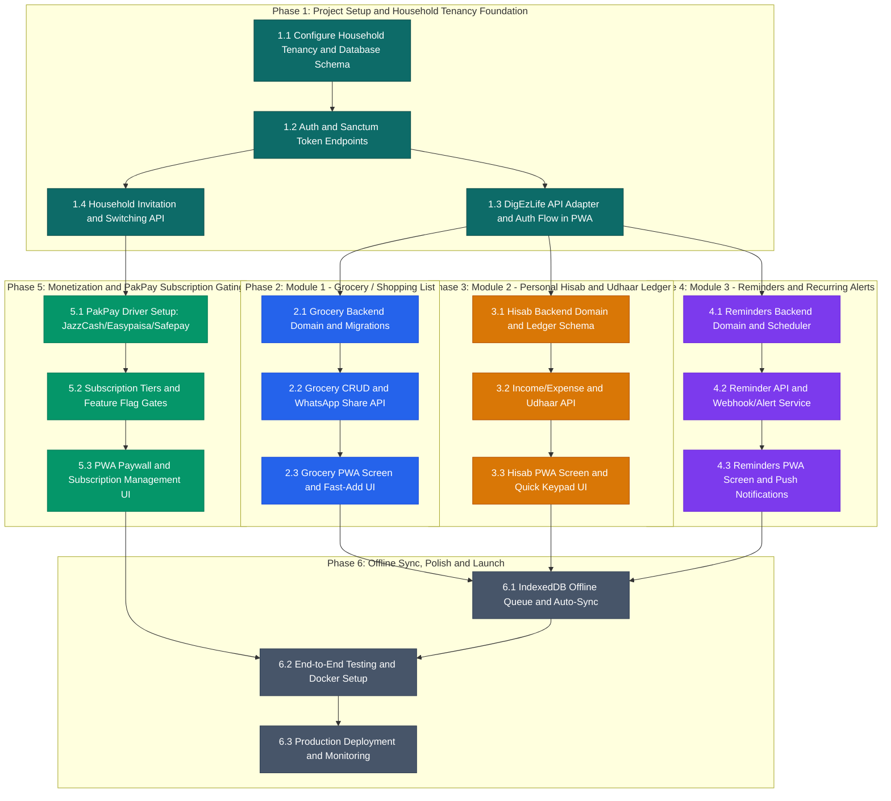

# DigEzLife - Phase-Wise Project Execution Plan and DAG Roadmap

**Project**: DigEzLife (Everyday Personal and Household Digital OS)  
**Target Market**: Pakistan and Emerging Consumer Mass-Market (PKR 100-500/mo)  
**Architecture**: Monorepo/Multi-package with Laravel 13 SaaS Backend + Mobile-First PWA Client  
**Version**: 1.0.0-alpha  
**Date**: 2026-09-16  

---

## 1. System Architecture and Component Mapping

```
+------------------------------------------------------------------------+
|                        DigEzLife PWA (Frontend)                        |
|            Location: digezlife-pwa/                                    |
|            Tech: Vite + Web Awesome + PWA Service Worker               |
+-----------------------------------+------------------------------------+
| Grocery Views                     | Hisab / Udhaar Views               |
| Reminder / Task Views             | Family Invite & Household Switch   |
| Offline Cache / Local Sync        | WhatsApp Export & Share Links      |
+-----------------------------------+------------------------------------+
                                    |
                                    | HTTPS / REST JSON:API + Bearer Token
                                    v
+------------------------------------------------------------------------+
|                        DigEzLife SaaS (Backend)                        |
|         Location: digezlife-backend/                                   |
|         Tech: Laravel 13 + Octane + Multi-Tenancy + ARBAC              |
+------------------------------------------------------------------------+
| Household Tenancy Scope (tenant_id shared single-DB model)             |
| Sanctum Auth, OAuth2 & NanoID Security (USR_, HSH_, GRC_, ...)         |
| Feature Flags & Quota Gating (laravel/pennant + Spatie Settings)       |
| PakPay Billing Adapter (JazzCash, Easypaisa, Safepay)                  |
+------------------------------------------------------------------------+
|                      Pluggable Domain Modules                          |
| +------------------------+ +------------------------+ +--------------+ |
| | modules/grocery        | | modules/hisab          | | modules/     | |
| |  - Lists & Categories  | |  - Income & Expenses   | |    reminders | |
| |  - Checked / Unchecked | |  - Udhaar / Debts      | |  - Schedules | |
| |  - Recurring restock   | |  - Monthly Cashflow    | |  - Expiries  | |
| +------------------------+ +------------------------+ +--------------+ |
+------------------------------------------------------------------------+
```

---

## 2. Phase-Wise Execution Roadmap and DAG



---

## 3. Detailed Phase Breakdown

### Phase 1: DigEzLife Foundation and Household Tenancy
* **Task 1.1: Database and Tenancy Architecture**:
  * Set up SQLite/PostgreSQL connection for DigEzLife Backend.
  * Establish the **Household Tenancy Scope** (`households` table, `user_household` pivot with roles: `owner`, `member`).
  * Ensure single shared database strategy with `tenant_id` for optimal hosting economics (<$20/mo VPS).
* **Task 1.2: Identity and Token Auth**:
  * Wire Laravel Sanctum endpoints (`/api/v1/auth/register`, `/api/v1/auth/login`, `/api/v1/auth/me`).
  * Generate URL-safe NanoIDs (`HSH_xxx`, `USR_xxx`).
* **Task 1.3: DigEzLife PWA API Adapter Integration**:
  * Create `src/adapters/apiAdapter.js` in DigEzLife PWA with automatic Axios bearer token injection.
  * Connect Auth and Onboarding screens to real backend authentication.
* **Task 1.4: Household Invitations and Sharing**:
  * Backend endpoints for generating household invite tokens and joining households.
  * PWA household switcher in profile header.

---

### Phase 2: Module 1 - Grocery / Shopping List (`modules/grocery`)
* **Task 2.1: Backend Domain and Migrations**:
  * Create `modules/grocery/module.json` (ID: `digezlife.grocery`).
  * Migrations for `grocery_lists`, `grocery_items` (name, quantity, unit, is_checked, category, sort_order).
* **Task 2.2: API Endpoints**:
  * CRUD endpoints for lists and items.
  * Batch toggle/check endpoint.
  * WhatsApp text export endpoint (generates formatted markdown/text for 1-click sharing via WhatsApp Web/App).
* **Task 2.3: PWA Grocery View**:
  * Bottom-nav tab for Grocery.
  * Real-time item toggling, quick swipe-to-delete, auto-complete suggestions for frequent groceries.

---

### Phase 3: Module 2 - Personal Hisab and Udhaar Ledger (`modules/hisab`)
* **Task 3.1: Backend Domain and Migrations**:
  * Create `modules/hisab/module.json` (ID: `digezlife.hisab`).
  * Migrations for `hisab_transactions` (type: income/expense/debt, amount, category, date, notes) and `hisab_debts` (person_name, phone, amount, direction: lent/borrowed, due_date, status: pending/settled).
* **Task 3.2: API and Analytics Endpoints**:
  * Transaction entry and filtering by date/category.
  * Monthly cashflow summary and expense breakdown endpoint.
  * Udhaar repayment logging and WhatsApp repayment reminder generator.
* **Task 3.3: PWA Hisab View**:
  * Quick numerical keypad entry screen.
  * Visual balance card (Cash In, Cash Out, Net).
  * Udhaar (Borrow/Lend) list with status pills.

---

### Phase 4: Module 3 - Reminders and Recurring Alerts (`modules/reminders`)
* **Task 4.1: Backend Domain and Scheduling Engine**:
  * Create `modules/reminders/module.json` (ID: `digezlife.reminders`).
  * Migrations for `reminders` (title, due_at, recurrence_rule: daily/weekly/monthly/yearly, category: bill/medicine/renewal/birthday/maintenance, is_completed, notify_channels).
  * Laravel Artisan cron worker to process due reminders.
* **Task 4.2: API and Notification Dispatcher**:
  * Reminder CRUD endpoints.
  * Webhook and notification dispatcher (Email / Web Push / SMS / WhatsApp notification stubs).
* **Task 4.3: PWA Reminders View**:
  * Calendar and upcoming agenda view.
  * Quick-add reminder modal with recurrence preset buttons.
  * Web Push API permission requester.

---

### Phase 5: Monetization and PakPay Subscription Gating
* **Task 5.1: PakPay Payment Gateway Adapter**:
  * Integrate PakPay (JazzCash, Easypaisa, Safepay drivers) into the billing domain.
  * Webhook listeners for payment verification.
* **Task 5.2: Subscription Gating**:
  * Define tiers in `spatie/laravel-settings` / `laravel/pennant`:
    * **Free (PKR 0)**: 1 Grocery List, 30 Hisab entries/month, 5 Reminders.
    * **Plus (PKR 249/mo)**: Unlimited items, full history, export tools.
    * **Family (PKR 499/mo)**: Up to 5 household members, shared sync.
* **Task 5.3: PWA Paywall and Subscription Management UI**:
  * Native checkout redirect / QR prompt for Easypaisa & JazzCash.
  * Plan status indicator in user settings.

---

### Phase 6: Offline Sync, Polish and Launch
* **Task 6.1: Offline Mutation Queue**:
  * IndexedDB integration in the PWA to store actions while offline.
  * Auto-sync queue resolution upon `window.online`.
* **Task 6.2: Testing and Quality Assurance**:
  * Pest PHP unit and feature tests for all 3 backend modules.
  * Playwright automated PWA UI tests.
* **Task 6.3: Production Deployment Setup**:
  * Single Docker container / Docker Compose profile for VPS deployment (Nginx, PHP-FPM / Octane, SQLite/PostgreSQL, Redis).

---

## 4. Verification and Quality Gates

| Phase | Quality Gate Criteria |
| :--- | :--- |
| **Phase 1** | User registers, logs in via PWA, receives Sanctum token, and creates/joins a Household. |
| **Phase 2** | User adds, edits, checks off groceries, and generates a WhatsApp share link that opens on mobile. |
| **Phase 3** | User logs income/expenses via quick keypad, views monthly net balance, and logs Udhaar with due dates. |
| **Phase 4** | User schedules recurring bill/medicine reminders and receives timely notification dispatches. |
| **Phase 5** | Free tier limits enforced; payment redirect via JazzCash/Easypaisa sandbox unlocks Plus tier. |
| **Phase 6** | User goes offline, adds items, reconnects, and data automatically syncs to backend without conflict. |
